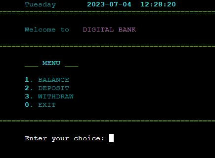
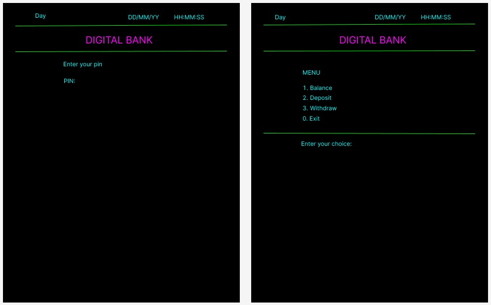
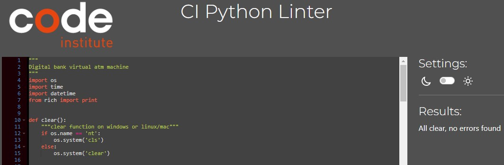

# DIGITAL BANK ATM
Digital bank atm is a must in order to control the money that you have.If you are old enough to have an open bank account then you should definitely be familiar with digital banking and you should understand how to use it. Online banking system  created for simple and easy use, atm gives you all the information needed for your daily banking such as time and date of the transaction made. On the designed menu for digital banking atm you have all the options needed to access anything you want for banking such as to control your money by giving you the options to deposit, withdraw and showing you your ballance.

[LIVE PAGE](https://digital-atm-56d733d7dee9.herokuapp.com)

# FEATURES
## Existing Features
## Future Features
# WIREFRAME

This application madded for terminal so design is not complicated, and wireframes ended as intended without marginal differences.

# USER STORIES

| USER | FEATURE |
| --- | --- |
| Check time | Added time and date |
| Protection to user account | Added pin password |
| Check account balance | Balance can be visible in real time |
| Add money to account | Deposit function, which add user money to account and updates account balance |
| Take money from account | Withdraw function, which give user money from account and updates accounts balance |
| Can leave ATM | Exit function which turns off application |

# TESTING

## Automated testing

No issues was found after pasting code in CI Python Linter

## Manual testing

| Feature | Test | Result |
| --- | --- | --- |
| Loading screen | Starting as intended | After starting program loading screen starts |
| Loading screen | Counting in right order | After starting program percents starts and counts in the right order |
| Loading screen | Finish count | Number counts and stops at 100% as intended |
| Loading screen | Loads main program | After reaching 100% loads main program |
| Date and time | Shows section with date and time on the top of program | Date and time shows in correct location |
| Date and time | Shows day by its name | Correct day name is represented |
| Date and time | Shows year, month, day and currant time | Date and time represented correctly |
| Welcome message | Visible welcome message | Welcome message in correct location and shows as intended |
| PIN | Visible text message | 'Enter your pin:' message shows as intended |
| PIN | Correct location of user input | User input clearly visible for input |
| PIN | After user type correct pin, menu been loaded | Menu been loaded after correct pin |
| PIN | User type wrong pin first time, error message been shown | After wrong input error message are shown |
| PIN | After wrong user input, error message shown remaining 3 attempts | Remaining 3 attempts are shown |
| PIN | Multiple wrong inputs are registered and been shown | After multiple wrong inputs, remaining attempts are reducing |
| PIN | After 4 wrong inputs, message 'card locked' are shown and terminates program | After last remaining attempt message are shown and program exits |
| PIN | Error message shown if user inputs something else then number | Error been shown if letters and symbols are typed |
| PIN | After any user action program returns to primary state for input | Program returns |
| MENU | Menu are visible, and in the right order | After correct user input menu are shown |
| MENU | User menu choice input section visible | User clearly can see where can be entered his choice |
| MENU | User input 1, loads balance section | Balance are represented |
| MENU | User input 2, loads deposit section | Deposit are represented |
| MENU | User input 3, loads withdraw section | Withdraw are represented |
| MENU | User input 0, exits off program | Program exits |
| MENU | User inputs any number non existing in the menu, gets error | Error represented after invalid input |
| MENU | User inputs not a number, error been represented with message | Error represented with message |
| Balance | After user input, account balance been shown on screen | Remaining balance been represented |
| Balance | After balance been shown, program automatically returns to menu | Returns to menu |
| Deposit | After user input, deposit menu are shown | Deposit menu are shown |
| Deposit | user input represented with message 'enter the amount to deposit' | User gets message and can type the amount |
| Deposit | After successful deposit updated balance are represented | Balance are updated |
| Deposit | User inputs something else then numbers, error been represented | Error been shown |
| Deposit | After successful deposit, program returns to main menu | Program returns automatically |
| Withdraw | After user input, withdraw menu are shown | Withdraw menu are shown |
| Withdraw | User represented with message 'Enter the amount to withdraw' | User gets message and can type the amount |
| Withdraw | After successful withdraw updated balance are represented | Balance are updated |
| Withdraw | User get error message if withdraw amount are bigger then amount in account |
| Withdraw | User inputs something else then numbers, error been represented | Error been shown |
| Withdraw | After successful withdraw, program returns to main menu | Program returns automatically |
| Exit | After user input, program exits | Program exits as intended |

# BUGS
# TECHNOLOGIES
# DEPLOYMENT
# CREDITS

